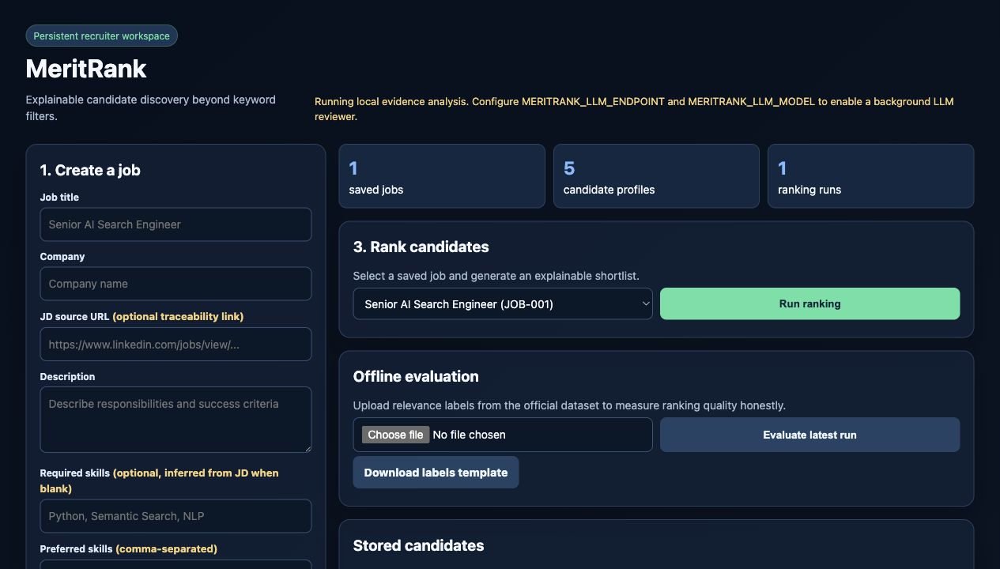
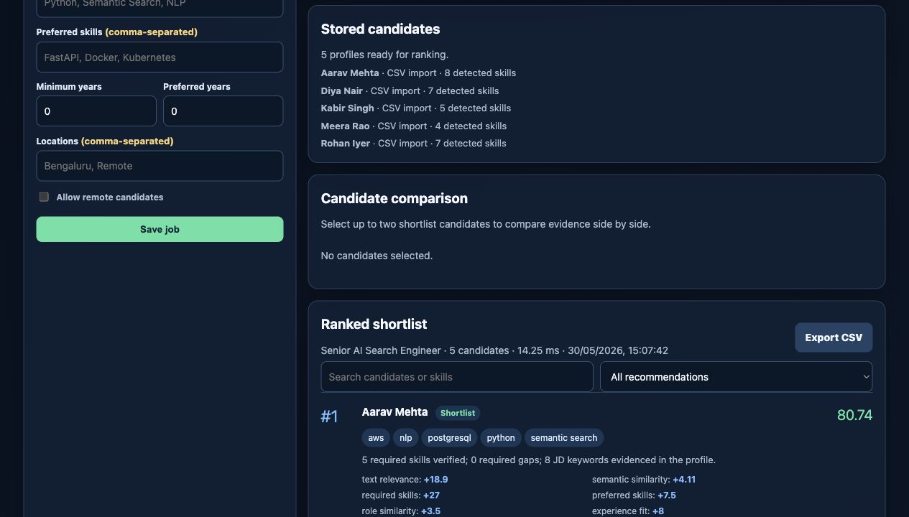

# MeritRank

MeritRank is a privacy-first, explainable candidate-ranking application for the
INDIA.RUNS Data & AI Challenge. It turns a real job description and a pool of
candidate profiles into an auditable shortlist with evidence for every
recommendation.

The core ranking engine intentionally runs with the Python standard library
only. Optional local LLM enrichment uses Ollama and keeps resume data on the
machine. This is a working application, not a UI mock.

## Why it is useful

- Ranks candidates beyond exact keyword matching with BM25 retrieval,
  concept-aware semantic similarity, skill alias normalization, structured
  reranking, and required-skill penalties.
- Ignores names, emails, phone numbers, and other protected or identifying
  attributes while scoring.
- Explains score contributions, missing keywords, required-skill gaps, and
  truthful resume improvement suggestions.
- Parses individual PDF, TXT, and MD resumes locally and suppresses duplicate
  uploads.
- Supports shortlist search, recommendation filters, candidate comparison, and
  CSV export.
- Measures ranking quality with NDCG@10, precision@10, recall@10, and MRR when
  relevance labels are supplied.
- Serves a JSON API, a browser dashboard, and a CSV export suitable for a
  challenge submission.
- Includes transparent synthetic demo data and automated tests.

## Screenshots

The screenshots below use the included synthetic profiles. No uploaded resume
or private candidate data is committed to the repository.

### Recruiter workspace



### Explainable ranked shortlist



## Run the demo

```bash
python3 scripts/run_demo.py
```

This prints a shortlist and writes `artifacts/ranked_candidates.csv`.

## Run the recruiter app

```bash
python3 -m talent_ranker.server
```

Then open [http://localhost:8000](http://localhost:8000).

The browser workspace is persistent across refreshes. It supports:

1. Creating real job descriptions and role requirements.
2. Uploading individual resumes or importing candidate profiles from CSV.
3. Running a hybrid lexical, semantic, and structured shortlist.
4. Reviewing contributions, missing terms, and local LLM evidence analysis.
5. Searching, filtering, and comparing candidates.
6. Uploading relevance labels to calculate offline ranking metrics.
7. Exporting each shortlist as CSV.

Download the CSV schema from the app or start with
[`data/candidate_import_template.csv`](data/candidate_import_template.csv).

Individual resumes can also be uploaded as PDF, TXT, or MD files. PDF text is
extracted locally with macOS PDFKit. Scanned-image PDFs require OCR before
upload. Resume parsing is intentionally reviewable: detected fields assist the
shortlisting workflow but should not be treated as infallible.

## Optional LLM reviewer

MeritRank always provides local evidence analysis. To add a background
OpenAI-compatible LLM reviewer, start the server with:

```bash
MERITRANK_LLM_ENDPOINT=https://your-provider.example/v1/chat/completions \
MERITRANK_LLM_MODEL=your-model \
MERITRANK_LLM_API_KEY=your-key \
python3 -m talent_ranker.server
```

When enabled, the job description and resume text are sent to that configured
endpoint. The UI discloses the active mode. Without configuration, the app does
not claim to use an LLM.

For the installed free local Ollama setup, run:

```bash
bash scripts/run_local_ai.sh
```

The default local model is `qwen2.5:0.5b`. It has no API fee and keeps resume
and JD text on the machine.

## LinkedIn API boundary

The app stores an optional JD source URL for traceability, including LinkedIn
job URLs. It does not scrape LinkedIn or pretend to call a public LinkedIn job
search API. LinkedIn Talent Solutions APIs require approved partner access.

Example API request:

```bash
curl -X POST http://localhost:8000/rank \
  -H 'Content-Type: application/json' \
  --data @data/demo_request.json
```

## Test

```bash
python3 -m unittest discover -s tests -v
```

Run the synthetic evaluator smoke test:

```bash
python3 scripts/evaluate_demo.py
```

These synthetic metrics verify the workflow only. Use the official organizer
dataset for submission claims.

## Ranking model

The current score is deterministic and inspectable:

| Component | Weight | Purpose |
| --- | ---: | --- |
| BM25 relevance | 20% | Measures contextual overlap with the complete profile |
| Semantic similarity | 16% | Matches related concepts beyond exact phrasing |
| Required skill coverage | 27% | Rewards hard requirements and penalizes gaps |
| Preferred skill coverage | 10% | Distinguishes strong candidates |
| Role similarity | 7% | Matches prior roles with the target role |
| Experience fit | 8% | Measures fit against minimum and preferred experience |
| Activity signal | 6% | Uses bounded completeness, response rate, and freshness |
| Location fit | 6% | Respects remote and location preferences |

The service retrieves using lexical and concept-aware semantic relevance, then
reranks using structured evidence. It does **not** infer sensitive traits.

## API

- `GET /health` returns service status.
- `GET /analysis/status` reports local-evidence or LLM mode.
- `GET /jobs`, `POST /jobs` list and create jobs.
- `GET /candidates`, `POST /candidates/import` manage imported candidate data.
- `POST /resumes/import` extracts and stores an individual resume locally.
- `GET /runs`, `POST /runs` manage persistent ranking runs.
- `GET /runs/{run_id}/export.csv` exports a shortlist.
- `POST /runs/{run_id}/evaluate` stores offline ranking metrics from labels.
- `GET /demo` ranks the included synthetic dataset.
- `POST /rank` ranks the submitted payload.
- `GET /` serves the dashboard.

The `POST /rank` payload is documented by the working example in
[`data/demo_request.json`](data/demo_request.json).

## Project layout

```text
talent_ranker/            ranking engine, evaluator, parser, persistence, API
data/                     synthetic demo input and import templates
scripts/run_demo.py       CLI demo and CSV exporter
scripts/run_local_ai.sh   free local Ollama launcher
static/index.html         recruiter workspace
tests/                    unit and integration tests
docs/                     architecture, submission guide, article draft
docs/images/              privacy-safe synthetic product screenshots
```

## Honest limitations and next steps

This baseline is designed to work before the official dataset is released. It
has not been evaluated against Redrob's private labels, and the demo candidates
are synthetic. The next evidence-driven steps are:

1. Map the official profile and activity columns into `Candidate`.
2. Measure NDCG@10, precision@10, recall@10, latency, and fairness slices.
3. Tune weights on a validation split.
4. Add multilingual embeddings as a retrieval feature only if they improve
   measured ranking quality.
5. Add recruiter feedback as explicit labels for a learned reranker.
