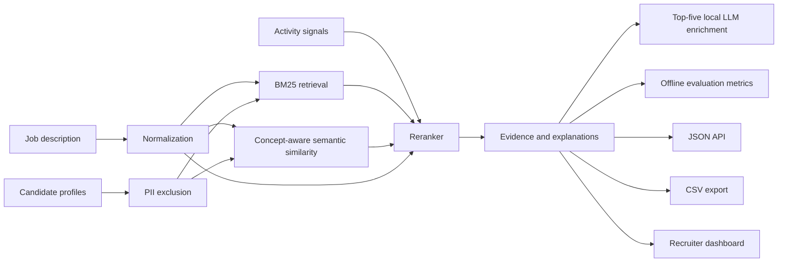

# MeritRank architecture

## Design decisions

1. Identifying fields are carried to the reviewer interface but excluded from
   the scoring document.
2. Required-skill gaps are penalized and surfaced instead of hidden inside one
   opaque score.
3. Behavioral inputs are bounded and low-weight so recruiter-relevant signals
   help prioritize review without dominating skill fit.
4. The engine is deterministic. This makes early validation, debugging, and
   challenge evaluation straightforward.
5. The pipeline leaves a clear extension point for multilingual embeddings and
   a learned reranker after labeled evaluation data exists.
6. Local LLM enrichment is limited to the top five candidates in a run. This
   keeps ranking responsive for larger pools while preserving richer review
   guidance where it matters most.
7. Offline relevance labels produce NDCG@10, precision@10, recall@10, and MRR.
   Synthetic metrics are smoke tests only; official claims require organizer
   data.
