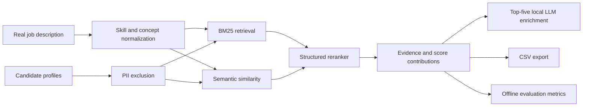

# MeritRank submission guide

## Positioning

MeritRank is a privacy-first, explainable candidate discovery engine. It uses a
hybrid retrieval pipeline:

1. BM25 lexical retrieval for transparent relevance.
2. Concept-aware semantic similarity for vocabulary variation.
3. Structured reranking for required skills, preferred skills, role,
   experience, location, and bounded activity signals.
4. Optional local LLM enrichment for the highest-ranked candidates.
5. Audit-ready score contributions, keyword gaps, and improvement guidance.

## Judge demo flow

1. Start the local model and application with `bash scripts/run_local_ai.sh`.
2. Create a company-specific job and paste its real JD text.
3. Upload multiple resumes or import a candidate CSV.
4. Run ranking and show score contributions plus `Shortlist`, `Review`, and
   `Hold` recommendations.
5. Search or filter the shortlist and compare two candidates side by side.
6. Upload relevance labels and show `NDCG@10`, precision@10, recall@10, and
   MRR.
7. Export the ranked CSV.

## Claims that require the official dataset

Do not claim ranking-quality improvements until the organizer dataset is
available. Evaluate against a held-out split and report:

- NDCG@10
- precision@10
- recall@10
- MRR
- median and p95 latency
- fairness slices approved by the challenge rules

The included synthetic smoke test is only a workflow verification artifact.

## Architecture

